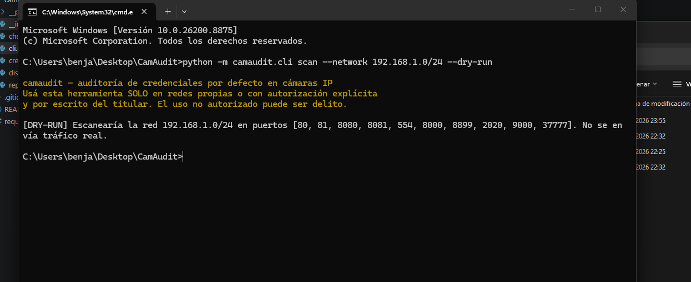
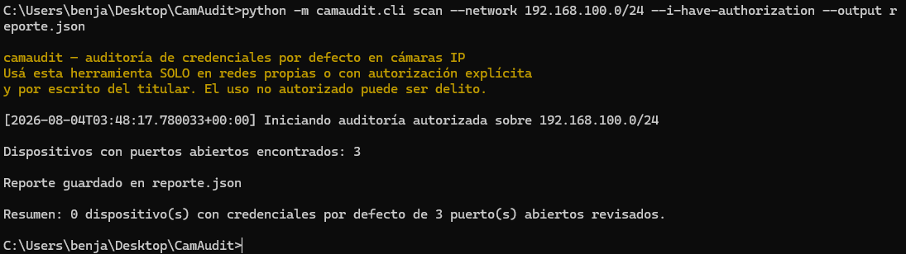

# camaudit

Herramienta de auditoría de seguridad para detectar cámaras de vigilancia IP
(HTTP, RTSP, ONVIF) que siguen usando **credenciales por defecto** dentro de
una red autorizada.

El objetivo es dar a un auditor / equipo de seguridad interna una forma
rápida de encontrar cámaras y dispositivos mal configurados antes de que lo
haga un atacante, y generar un reporte para que la compañía los corrija.

> ⚠️ **`camaudit` NO** transmite video, NO borra grabaciones, NO cambia
> configuraciones y NO deja backdoors. Solo intenta autenticarse con
> credenciales por defecto conocidas y reporta si funcionaron o no.
> Cualquier acción posterior a la detección es responsabilidad del auditor
> y debe estar dentro del alcance autorizado por escrito con el cliente.

---

## Demo

**Modo simulación (`--dry-run`)** — no envía tráfico real, solo muestra el plan de escaneo:



**Auditoría real** sobre una red local, con el reporte generado en JSON:



---

## ⚖️ Aviso legal — leé esto antes de usar la herramienta

Usar `camaudit` contra redes o dispositivos que no sean tuyos, o sobre los
que no tengas **autorización explícita y por escrito** del dueño/administrador,
puede constituir un delito (acceso indebido a sistemas informáticos) en
Argentina (art. 153 bis del Código Penal) y en la gran mayoría de los países.

Por eso la herramienta:

- Requiere el flag `--i-have-authorization` para correr un scan real.
- Escribe en el log, en cada ejecución, la fecha, el rango escaneado y una
  advertencia de que el usuario declaró tener autorización.
- No hace nada por default: sin ese flag, solo simula (`--dry-run`).

Usalo exclusivamente en:
- Redes propias / de tu laboratorio.
- Redes de una compañía que te contrató para un pentest o auditoría, con
  alcance (scope) firmado.

## Instalación

```bash
git clone https://github.com/tu-usuario/camaudit.git
cd camaudit
python3 -m venv venv && source venv/bin/activate
pip install -r requirements.txt
```

## Uso básico

```bash
# Simulación (no envía nada, solo muestra qué haría)
python -m camaudit.cli scan --network 192.168.1.0/24 --dry-run

# Auditoría real, con autorización confirmada
python -m camaudit.cli scan --network 192.168.1.0/24 \
    --i-have-authorization \
    --output reporte.json
```

### Opciones principales

| Flag | Descripción |
|---|---|
| `--network` | Rango CIDR a escanear (ej. `192.168.1.0/24`) |
| `--ports` | Puertos a probar (por default: lista de puertos típicos de cámaras) |
| `--timeout` | Timeout por conexión en segundos (default 2) |
| `--threads` | Nivel de concurrencia (default 50) |
| `--output` | Archivo de salida (`.json` o `.csv`) |
| `--i-have-authorization` | Confirma que tenés autorización para auditar la red indicada |
| `--dry-run` | No realiza conexiones reales, solo muestra el plan de escaneo |

## Qué detecta

1. Descubrimiento ONVIF (WS-Discovery): antes de escanear puertos, envía
   un probe multicast estándar que **solo responden cámaras/NVRs
   compatibles con ONVIF**. Las IPs que contestan quedan marcadas como
   "cámara confirmada" — es la señal más confiable con la que cuenta la
   herramienta.
2. Descubrimiento por puerto: en paralelo, barre el rango de red
   buscando puertos abiertos típicos de cámaras IP (80, 8080, 8081, 554,
   8000, 37777, 2020, 9000, etc.). **Cualquier dispositivo** que tenga esos
   puertos abiertos aparece acá, no solo cámaras — un router o un NAS
   también pueden aparecer.
3. Prueba de credenciales por defecto: contra los servicios detectados
   (HTTP Basic/Digest, RTSP) usando una lista pública y conocida de
   credenciales por defecto documentadas por los propios fabricantes.
4. Reporte separado por nivel de confianza: el resultado final
   distingue entre:
   - `camaras_confirmadas_vulnerables`: dispositivos que respondieron
     ONVIF **y** aceptaron una credencial por defecto — alta certeza de
     que es una cámara real y vulnerable.
   - `otros_dispositivos_vulnerables`: dispositivos que aceptaron una
     credencial por defecto en un puerto típico de cámara, pero **no**
     se confirmaron por ONVIF — puede ser una cámara sin soporte ONVIF,
     o puede ser otro tipo de dispositivo (ver Limitaciones).

## Limitaciones conocidas

- La confirmación por ONVIF depende de que el dispositivo tenga ese
  protocolo habilitado y de que el probe multicast llegue (algunas
  redes/switches filtran multicast entre segmentos). Una cámara real
  puede terminar en "sin confirmar" si no responde ONVIF, no solo
  dispositivos ajenos a cámaras.
- El checker HTTP solo reporta un dispositivo como vulnerable si primero
  confirma que usa autenticación HTTP real (`401 Unauthorized` sin
  credenciales) y luego alguna combinación de la lista es aceptada.
  Paneles con login por formulario HTML (muy comunes en routers domésticos
  y algunos DVRs) devuelven `200 OK` incluso sin credenciales válidas, así
  que **no se evalúan por este checker** — evita falsos positivos, a costa
  de no cubrir ese tipo de paneles.
- El checker RTSP hace un `DESCRIBE` genérico contra la raíz (`/`). Muchas
  cámaras reales requieren una ruta de stream específica por marca
  (ej. `/cam/realmonitor` en Dahua, `/Streaming/Channels/1` en Hikvision)
  para responder `200 OK`, así que puede haber falsos negativos en RTSP.
- La lista de credenciales por defecto es acotada (~17 combinaciones) y
  pensada como base de referencia, no como diccionario exhaustivo.

